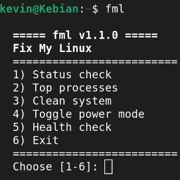

# fml — Fix My Laptop

A lightweight Linux system maintenance tool built for low-spec and older machines, doesnt magically imporve performance but it would be good to run it every once in a while if you feel your system slowing down.



## Install
```bash

git clone https://github.com/Melangert/Fix-My-Laptop-FML-.git
cd Fix-My-Laptop-FML-

sudo cp ./fml /usr/local/bin/fml
sudo chmod +x /usr/local/bin/fml
fml --help
```
or with the tar release cd into install directory then
```bash
tar -xzf extract.tar.gz
sudo install -m 755 fml /usr/local/bin/fml

```


## Requirements
-Linux distro
-Bash


## How to use

```bash
fml              # Interactive menu
fml status       # Show load, memory, and disk
fml top          # Top CPU and memory processes
fml clean        # Remove unused packages and caches
fml boost        # Toggle CPU power mode
fml health       # Health check with warnings
fml temps           Check hardware temperatures
fml --help
fml --version
fml fix                # auto fix problems that are detected
fml suggest              # get recommendations base off your system
fml monitor            # live refreshing system view 
fml clean --dry-run      # preview cleanup without changing anything

## Power Mode Toggle

`fml boost` toggles between **power-saver** and **performance** mode.

- **power-saver** — decreases performance but preserves battery health
- **performance** — maximum CPU speed, useful for shorter tasks.

Run `fml boost` once to switch to performance and run  again to switch back.
Works with `powerprofilesctl` `tuned-adm`   and `cpupower`.

## Cleanup 

`fml clean` removes:
- Unused packages 
- Unused flatpak runtimes and oldsnap revisions
- Thumbnail and browser caches
- Your temp files from /tmp
- System journal logs older than a week

Always asks for confirmation before making any changes fml will  never touch your personal files or documents.

## Supported package managers

| Manager | Distros |
|---------|---------|
| apt     | Debian, Ubuntu, Mint, Pop!_OS |
| dnf     | Fedora, RHEL, CentOS Stream |
| pacman  | Arch, Manjaro, EndeavourOS |
| zypper  | openSUSE |

  
## License

MIT — Kevin Melangert
```


## Credits
Used AI to deebug clean function and add temps and health.
